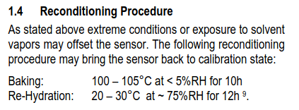
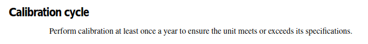

# Problem
Lab equipment needs to be re-calibrated.

None of the measurement equipment in this lab has been calibrated in several years. Including mission critical tools such as the humidity sensor and the Keithley multi-meter.

It is extremely important that we get our equipment calibrated, as taking un-calibrated measurements could invalidate all of our research.

There is no such thing as a sensor that does not need to be calibrated.

# Research
## Senserion Humidity and Temperature measurement device
The [datasheet](https://www.mouser.com/datasheet/2/682/Sensirion_Humidity_SHT7x_Datasheet_V5-469726.pdf) has a section stating that it will need to be calibrated after exposure to solvents.  
 

## Keithley multi-meter
The Keithley multi-meter has a whole section about calibration in the [datasheet](https://download.tek.com/manual/6514-901-01(D-May2003)(Instruction).pdf). In the datasheet, it states that calibration should be performed *at least* once per year.
 
The datasheet also shows how to view the date it was last calibrated. Following the steps, our Keithley multi-meter shows it was last calibrated March 2nd 2017. Since it has been over 7 years since it was last calibrated, it is overdue.
 