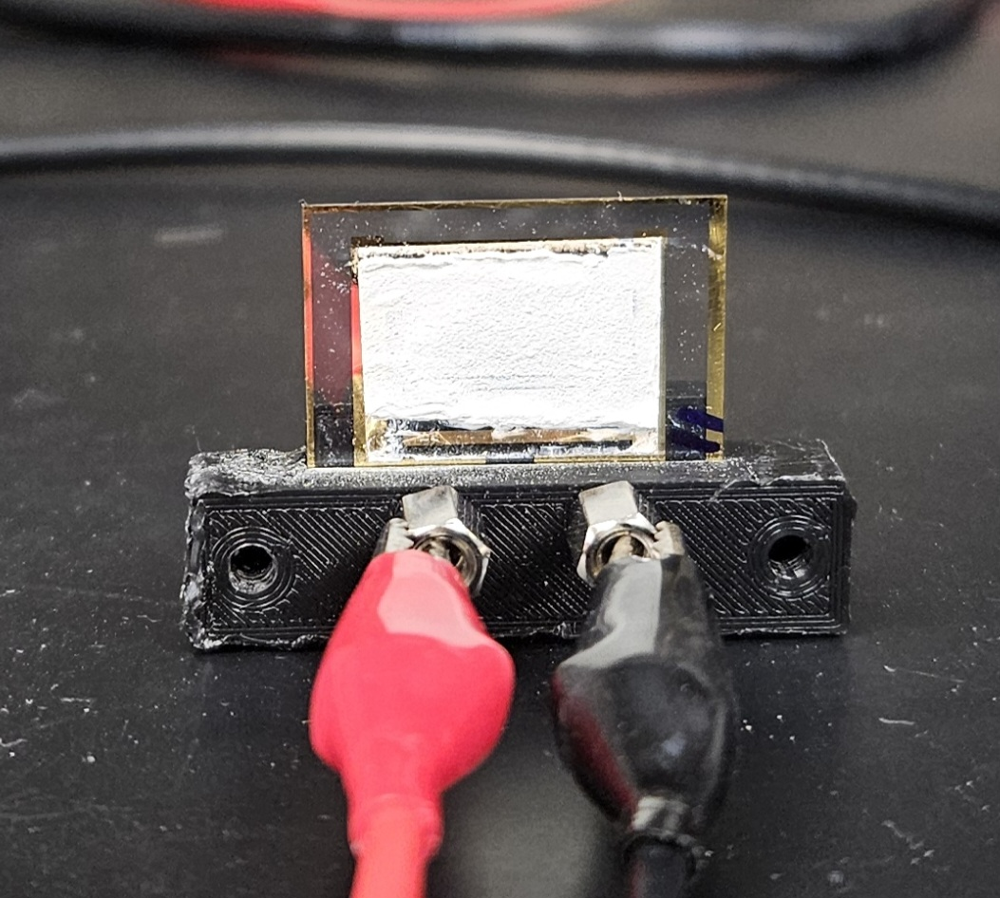

Today (5/13/2024), It was discovered that the KWO slides our group was using for testing concentrations of acetone, exhibit properties similar to batteries. This discovery came after Aaron K accidentally left a KWO slide connected to the Keithley multi meter on the ohms setting for approximately 72 hours. After which, the slide showed significant discoloration along one terminal of the slide. 
 
This was observed on Monday 5/13/2024 by Aaron K and Aaron W after the weekend. After observing the discoloration, both Aarons decided to test the slides response to acetone. After observing that the resistance across the slide appeared to be negative, Aaron W decided to connect the slide to a volt-meter to determine if the slide was holding a charge. The slide had a potential of 0.91V ~ 0.93V, and after being shorted, would recover to near the original potential. This indicated that some form of chemical reaction was occurring, and not simple capacitance.
# Creation of the Genesis Slide

# Characteristics of Genesis Slide
## Visual
The anode of the slide appears to be dark blue gray in color, while the cathode appears to be a light gray with a hint of blue. The area between the anode and cathode appears to be a slightly lighter blue gray than the anode. The slide was originally all the light gray color of the cathode, but after its extended charging using the Keithley ohm-meter, it became darker. the pattern appears to follow the gold tines under the KWO material. 
{PHOTO OF BACK OF SLIDE HERE}
There are several black spots on the slide, and chips in the material. It is currently assumed that these are impurities and defects, and do not contribute to the slides electrical properties.
## Reman
## XRD
## Electrical
- Max Voltage: 0.9V
- Voltage after Discharge: 0.2V
- Voltage after Recharge: 0.4V

# Mechanism Hypothesis
## $WO_3$ ⟷ $WO_2$ Reduction
This is the first proposed explanation for the Genesis slide's ability to store charge. some form of reduction within the tungsten oxide.

# Recreation attempts
## Slide 2
The second slide was constructed using another old KWO slide that had been sitting around for a while, and was due to be scrapped. The slide was connected to a 3.3V power supply for roughly 26 Hours. The coating of KWO on this slide was not very even, it was much thinner on the bottom than on the top. 

*0 Hours*
 
*1 Hour*
 
*2 Hours*
 
*3 Hours*
 
*4 Hours*
 
*5 Hours*
 
*26 Hours*
 

After 4 hours of charging, the slide was removed to test its charge. In this test, its initial voltage was measured, then its voltage with a variety of different sized loads where tested, and its final voltage reading was measured.

Resistance | Voltage across slide
-|-
inf Ω (initial) | 1.05V
9MΩ | 0.96V
1MΩ | 0.57V
500kΩ | 0.38V
100kΩ | 0.10V
50kΩ | 0.05V
10kΩ | 0.008V
5kΩ | 0.003V
1kΩ | 0.0006V
inf Ω (Recovered) | 0.886V

Measurements had a tendency to drop very slowly over time. so these data points would be lower if I had waited to take the measurements. This shows that the slide did pick up some charge over its 4 hour charging period. and shows that it does have some capacity, albeit very small. 

After this test was performed. The slide was returned to the charger and left undisturbed until the next day at the 26 hour mark. 

After 26 hours, the slide was removed from the 3.3V power supply, and a test was performed to verify that it behaves as a battery. 

 

This shows that these "cells" are reproducible in our lab, using our existing setups. Meaning our group can proceed with researching this material and attempting to optimize the results. 

# Variables in Creation of Battery Cells
- Thickness of materials in cells
  - **Genesis**: 2 pieces of tape (0.1mm approx)
  - **Best**:
  - **Worst**:
- Charging voltage
  - **Genesis**: 3 - 4V (Keithely Ohm Measurement)
  - **Best**:
  - **Worst**:
- Charging time
  - **Genesis**: ~64 Hours
  - **Best**:
  - **Worst**:
- Potassium concentration
  - **Genesis**: 125% of OG recipe
  - **Best**:
  - **Worst**:
- Acid Concentration (PH)
  - **Genesis**: 100% of OG recipe
  - **Best**:
  - **Worst**:
- Coordinating agents
  - **Genesis**: Oxalic acid 100% of OG recipe
  - **Best**:
  - **Worst**:
- Tungsten Concentration
  - **Genesis**: 100% of OG recipe
  - **Best**:
  - **Worst**:
- Crystal Morphology
  - **Genesis**: Hexagonal
  - **Best**:
  - **Worst**:
- Annealing time
  - **Genesis**: 1 Hour
  - **Best**:
  - **Worst**:
- Annealing temperature
  - **Genesis**: 350degC
  - **Best**:
  - **Worst**:
- Substitute Tungsten
  - **Genesis**: OG recipe
  - **Best**:
  - **Worst**:
# Properties of Battery
Genesis Slide:

Maximum Measured Voltage: 

# Recipes
## OG recipe

# Experiment Design Path

