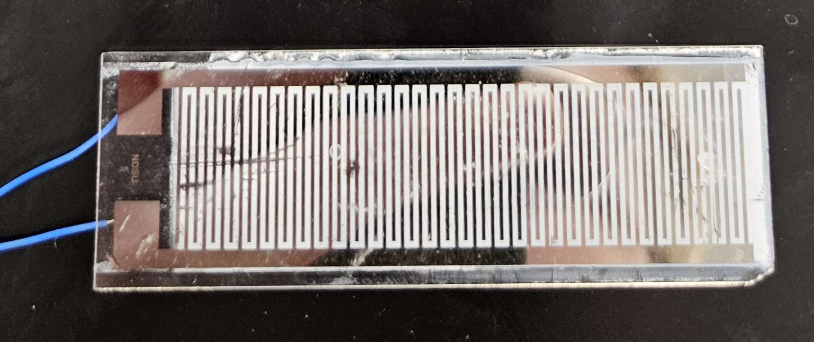

# Resistance of Sensor
Currently, our KWO slide samples have a very high resistance, this makes it difficult to acquire usable signals from our material. Currently, the sensor reads in the range of Gohms. Ideally we would like to reduce this resistance so that accurate measurements are easier.

## Potential methods for reducing resistance
### Change the KWO's surface area.
For all of our current testing we use slides with gold traces etched into them. Currently, the surface area of KWO on all of these slides is about $\frac{1}{2}inch$ by $\frac{3}{4}inch$. In the lab there exists slides that are much much longer however. In general, the more conductor is available, the lower the resistance will be. 
 

### Change the KWO's thickness
According to Aaron K. The thickness that the KWO is applied to the slide is inversely proportional to the resistance of the slide. Meaning that if the thickness of the KWO applied to the slide doubles, the sensors resistance is cut in half. This observation was based off some rough

### Change The K% of KWO Material
Test different initial conditions to change the % of potassium in the KWO material
- Characterize with Raman, XRD, UV/VIS
  
