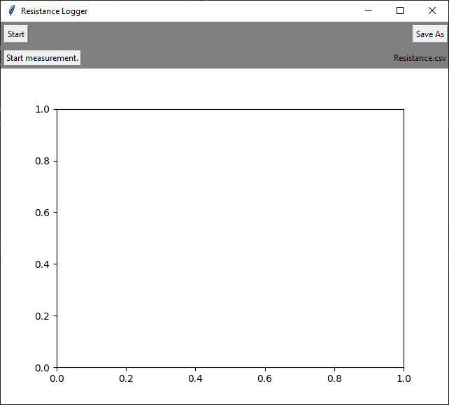

# Keithley Resistance Measurement
A good way to learn how to measure resistance using the Keithley multi-meter is to read the section in the [manual](https://download.tek.com/manual/6514-901-01(D-May2003)(Instruction).pdf#%5B%7B%22num%22%3A656%2C%22gen%22%3A0%7D%2C%7B%22name%22%3A%22Fit%22%7D%5D). Bar that, below is a few notes, pointers, and best practices.

- We are measuring in un-guarded mode. Which means the wires work as you would expect.
  - Red and Black wires for measuring resistance, Green wire is a ground.
 - When connecting and disconnecting the Keithley from the sample you are measuring:
   - Press the **ZCHK** button on the machine, and ensure that the reading shown on the screen is all 0's. Then it is safe to disconnect the load.
   - The Keithley uses up to 250V to measure very high resistances, If you do not "zero check" the machine before disconnecting the sample, you may shock yourself or damage the machine.
   - If the load is capacitive, it may take some time for the resistance measurement to settle. See the [Volts and ohms measurement considerations](https://download.tek.com/manual/6514-901-01(D-May2003)(Instruction).pdf#%5B%7B%22num%22%3A716%2C%22gen%22%3A0%7D%2C%7B%22name%22%3A%22Fit%22%7D%5D) section in the manual for more information.
## Automated Measurements
Oftentimes, collecting many data points over a period of time is useful. A program was created to collect resistance information from the Keithley once every second. The program can be found in the GitHub repo [here]()

 
# Noise in measurements
